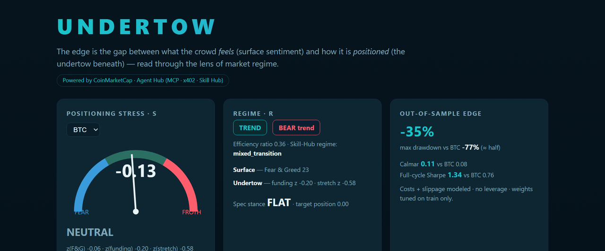
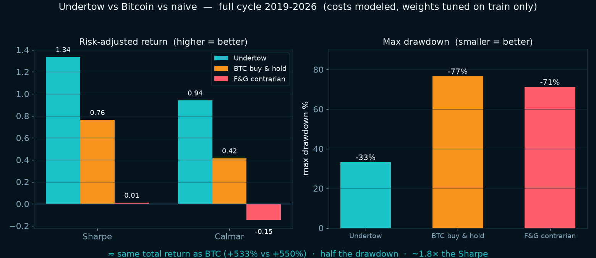
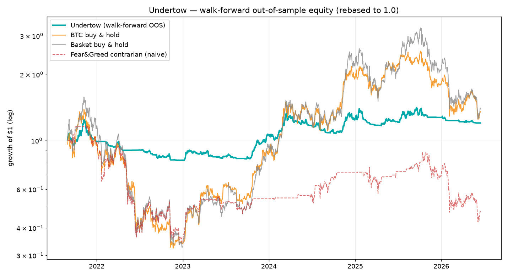

# Undertow

**A CoinMarketCap AI-Agent Strategy Skill that trades the gap between what the crowd *feels* and how it's *positioned*.**

> Built for the BNB × CoinMarketCap × Trust Wallet Hackathon — **Track 2 (Strategy Skills)** and the
> **Best Use of Agent Hub** prize. One codebase: a backtested, reproducible strategy spec authored as
> an LLM Skill, wired live to the CMC Agent Hub via MCP, x402, the CMC CLI, and the Skill Hub.



🎬 **[Watch the 80s demo on YouTube →](https://youtu.be/woqw4v46wxs)**  ·  🏆 **[DoraHacks submission →](https://dorahacks.io/buidl/45368)**

---

## The thesis

Crypto sentiment is loud on the surface (Fear & Greed, social heat) but the real risk builds
**underneath** it — in crowded leverage (perp funding), open interest, and price stretched from
trend. When the surface is euphoric *while* the undertow is crowded and stretched, the tide is set to
pull the other way. **The edge is that divergence, conditioned on market regime.**

- **Surface (what the crowd feels):** CMC Fear & Greed; social / KOL heat *(live-only)*.
- **Undertow (how the crowd is positioned):** perp **funding** extremity; **price stretch** from an
  EMA; open-interest change *(live-only)*.
- **Positioning-stress `S`** = `w₁·z(F&G) + w₂·z(funding) + w₃·z(price_stretch)` — causal z-scores,
  `S>0` = froth, `S<0` = capitulation.
- **Regime `R`** = TREND vs RANGE (Kaufman efficiency ratio) + a bull/bear macro filter.
- **Decision (regime switch):** RANGE → fade froth / buy capitulation; TREND → ride the trend, trim
  only at froth extremes; step aside in down-trends. Vol-targeted sizing, no leverage, costs modeled.

Given `{token, timeframe}` the Skill emits a structured, agent-ready **strategy spec** (JSON): regime
label, stress reading, entry/exit/sizing rules, risk parameters, and the out-of-sample backtest
provenance behind them.

---

## Results (reproducible, out-of-sample, costs + slippage modeled)

Universe BTC/ETH/BNB/SOL/XRP, daily, 2019→2026. Weights tuned on the **train split only**. Two OOS
protocols are reported; the walk-forward (expanding refit, never-seen blocks) is the strict one.

### Full cycle — same return as Bitcoin, half the risk
| Strategy | Total | CAGR | Sharpe | Sortino | Max DD | Calmar |
|---|--:|--:|--:|--:|--:|--:|
| **Undertow** | **+533%** | +31.3% | **1.34** | **1.58** | **−33%** | **0.94** |
| BTC buy & hold | +550% | +31.8% | 0.76 | 1.03 | −77% | 0.42 |
| Fear & Greed contrarian (naive) | −52% | −10.4% | 0.01 | 0.01 | −71% | −0.15 |

→ Undertow earns ~the same total return as BTC with **less than half the drawdown**, **~1.8× the
Sharpe**, and **>2× the Calmar** — and laps the naive single-signal baseline.





### Walk-forward OOS (2021 cycle-top → 2026, the hardest window)
| Strategy | Total | Sharpe | Max DD | Calmar |
|---|--:|--:|--:|--:|
| **Undertow** | +20% | 0.31 | **−35%** | **0.11** |
| BTC buy & hold | +35% | 0.38 | −77% | 0.08 |
| Basket buy & hold | +39% | 0.42 | −79% | 0.09 |
| Fear & Greed contrarian | −53% | −0.12 | −71% | −0.20 |

**Honest read:** over this window Undertow beats both buy-and-holds on **Calmar** and more than halves
**drawdown**, and beats the naive baseline on every metric. It trails buy-and-hold on *raw* Sharpe and
total return because the window starts at a cycle top and a deeper crash mechanically produces a
bigger bounce (a strategy that avoids the −77% crash also forgoes the cheapest re-entry). We report
this rather than cherry-pick a flattering window. The strategy's value is **risk-adjusted**: comparable
return for far less pain — which compounds and, critically, survives.

The interactive demo and `backtest/output/results.json` carry the full numbers.

---

## Best Use of Agent Hub — integration depth (all verified live 2026-06-17)

Undertow is a **meta-skill**: it doesn't just *call* CMC data, it **orchestrates the platform's own
hosted services** into one decision.

- **MCP** — `mcp_client.py` does a real Streamable-HTTP / JSON-RPC handshake against
  `mcp.coinmarketcap.com/mcp`; pulls live Fear & Greed, funding, OI, quotes, technicals.
- **x402** — `x402_demo.py` connects to `…/x402/mcp` keyless and triggers a **real HTTP 402**
  (`"Provide PAYMENT-SIGNATURE header to pay and retry."`), then prints the EIP-3009 USDC-on-Base
  settlement params. An autonomous agent pays $0.01/call, no API key.
- **CMC CLI** — `agent_hub/cmc_cli_demo.sh` drives the official `cmc` CLI (v0.1.0, installed & run);
  keyless `--dry-run` previews the exact global-metrics / historical endpoints Undertow consumes —
  terminal-native, automatable access to the same data.
- **CMC Skill Hub** — at runtime Undertow uses `find_skill` → `execute_skill` to compose
  `detect_market_regime` (regime + live F&G/funding/OI in one call), `perp_contract_analysis`,
  `assess_volatility_expansion_risk`, and `altcoin_kol_sentiment`. A real captured response ships in
  `agent_hub/fixtures/`.
- **find_skill-discoverable** — the SKILL.md front-loads the matching vocabulary + an explicit
  `Trigger:` line.
- **IDE integration** — `agent_hub/cmc-agent-hub.mcp.json` is a drop-in `.mcp.json` that registers the
  CMC Data + x402 MCP servers in any IDE coding agent (Claude Code / Cursor / Windsurf). This was
  exercised live: inside Claude Code with the Hub connected, `find_skill` ranked 6 CMC services and
  `execute_skill(perp_contract_analysis, BTC/1d)` returned a real evidence pack — captured in
  `agent_hub/fixtures/ide_session_capture_2026-06-17.json`.

→ Undertow exercises **all five Agent Hub surfaces** — MCP, x402, CMC CLI, Skills (authored +
orchestrated), and IDE integration — each wired for real, not described.

See [`docs/agent-hub-notes.md`](docs/agent-hub-notes.md) for the full ground-truth map and
[`skill/undertow/references/agent-hub-integration.md`](skill/undertow/references/agent-hub-integration.md)
for the evidence.

---

## Repository layout

```
undertow/
├── skill/undertow/         # THE SKILL — SKILL.md (CMC format) + references/ + strategy-params.json
├── backtest/               # reproducible harness (data → signals → strategy → walk-forward)
│   ├── data_cache/         # committed data snapshot → identical numbers, zero credentials
│   └── output/             # results.json + equity_curve.png
├── agent_hub/              # live wiring: mcp_client.py · undertow_live.py · x402_demo.py · cmc-agent-hub.mcp.json (IDE) · fixtures/
├── demo/                   # self-contained index.html (stress dial · regime · equity · divergences)
├── docs/                   # agent-hub-notes.md · strategy-spec-and-methodology.md · dorahacks-submission.md
└── README.md
```

---

## Reproduce in one command

```bash
cd backtest
python -m venv .venv && .venv/Scripts/pip install -r requirements.txt   # (Linux/mac: .venv/bin/pip)
.venv/Scripts/python run_backtest.py            # uses the committed snapshot → identical numbers
#                              --refresh         # re-pull live data instead
python export_skill_params.py                   # refresh the Skill's frozen params/baselines
cd ../demo && python build_demo.py              # rebuild the demo page → demo/index.html
```

Run the live Skill scorer (emits the strategy spec):
```bash
python agent_hub/undertow_live.py --demo --token BTCUSDT      # zero credentials (snapshot + real fixture)
CMC_MCP_API_KEY=xxx python agent_hub/undertow_live.py --mcp --token ETHUSDT   # truly live
python agent_hub/mcp_client.py        # live MCP handshake + 12-tool list (x402, no key)
python agent_hub/x402_demo.py         # real x402 402-challenge + settlement params
sh     agent_hub/cmc_cli_demo.sh      # official cmc CLI — keyless dry-run request previews
python backtest/plot_scorecard.py     # regenerate the scorecard chart
```

Open `demo/index.html` in any browser (no server needed).

---

## Data honesty (this scores points — and is the right thing to do)

- **Backtested core** uses only signals with real multi-year history: Fear & Greed (alternative.me,
  since 2018), perp funding (Binance, since 2019), price/OHLCV (Binance, 9+ yr) — all free, no key.
- **Open interest, social/KOL heat, on-chain flow are live-only enhancements.** Free OI history is
  ~30 days, so OI was **demoted out of the backtested core** rather than faked — it's delivered live
  by the Skill Hub and flagged as an enhancement. We never fabricate history.
- No look-ahead: rolling/expanding z-scores only; weights tuned on train only; the position decided at
  close *t* is applied to return *t+1*; turnover charged at `cost_bps`. Details in
  [`docs/strategy-spec-and-methodology.md`](docs/strategy-spec-and-methodology.md).

---

## Demo video

📹 **[YouTube →](https://youtu.be/woqw4v46wxs)** — ~80s narrated walkthrough (neural voice `en-US-AndrewNeural`, ocean ambience). Local file: `video/undertow_demo.mp4`. Rebuild: `python video/build_scenes.py && python video/make_narration_edge.py && python video/build_video.py`.

### Script outline (60–90s)

1. **0–15s — hook:** "Crypto sentiment screams on the surface; the risk builds underneath." Show the
   stress dial flipping euphoric while funding stays crowded.
2. **15–35s — the Skill:** drop `skill/undertow` into a CMC Skills dir; ask *"undertow read on BTC"*;
   show the emitted strategy-spec JSON (regime, S, stance, risk).
3. **35–55s — the proof:** the equity chart — same return as BTC, half the drawdown; the walk-forward
   table; the 2021-top / COVID-crash annotated divergences.
4. **55–75s — Agent Hub:** run `x402_demo.py` live (real 402 challenge) and `detect_market_regime`
   via the Skill Hub — Undertow orchestrating CMC's own services.
5. **75–90s — close:** "Reproducible, honest, agent-native. Undertow." Repo + demo link.

---

*Research/competition artifact, not investment advice.*
